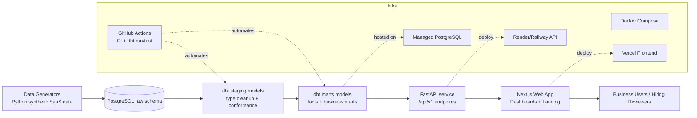
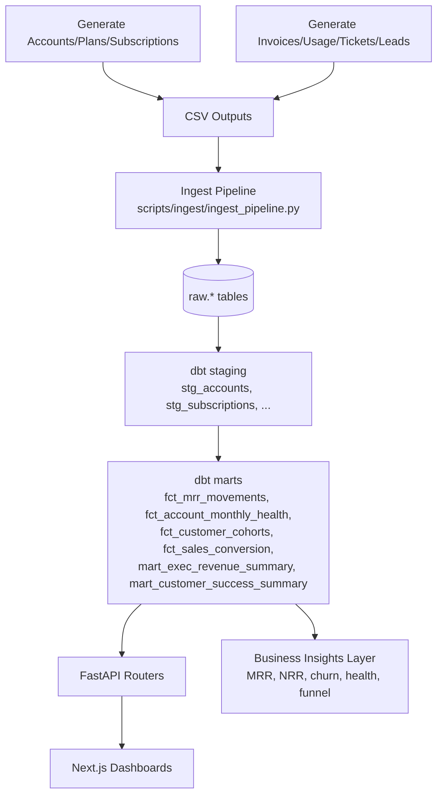

# FlowSync SaaS Revenue Intelligence — Architecture

## 1) System Architecture (Mermaid)

---

## 2) Data Flow Diagram (Mermaid)

---

## 3) Architectural Explanation

### Frontend
- **Framework:** Next.js (App Router) + TypeScript
- **UI:** Tailwind + reusable UI components
- **Charts:** Recharts for KPI trend and segment analysis
- **Interaction model:** Multi-page analytics UI with fallback mock data if API unavailable

### Backend
- **Framework:** FastAPI
- **Access pattern:** Router-based domain endpoints (`executive`, `revenue`, `cohorts`, `health`, `funnel`)
- **Data retrieval:** SQL-backed endpoint responses from marts tables

### Data Platform
- **Warehouse:** PostgreSQL
- **Modeling style:** Medallion (raw → staging → marts)
- **Transformation layer:** dbt
- **Synthetic data:** Python generators for realistic SaaS lifecycle behavior

### DevOps / Deployment
- **Local orchestration:** Docker Compose (`postgres`, `api`, `web`, optional `dbt`)
- **CI/CD:** GitHub Actions for lint/test and dbt run/test scheduling
- **Runtime targets:**
  - Frontend → Vercel
  - API + Postgres → Render or Railway managed services

---

## 4) Design Rationale

1. **Separation of concerns**
   - Data modeling logic in dbt
   - API logic in FastAPI
   - Presentation logic in Next.js

2. **Portfolio realism**
   - SaaS metrics mirror real RevOps/CSOps reporting needs
   - Cohorts + health + funnel provide multi-functional business lens

3. **Deployability**
   - Local-first Docker workflow and cloud-ready platform mapping
   - CI-compatible dbt execution model

4. **Extensibility**
   - Additional entities and KPIs can be added via staging + marts without major API/UI rewrites
